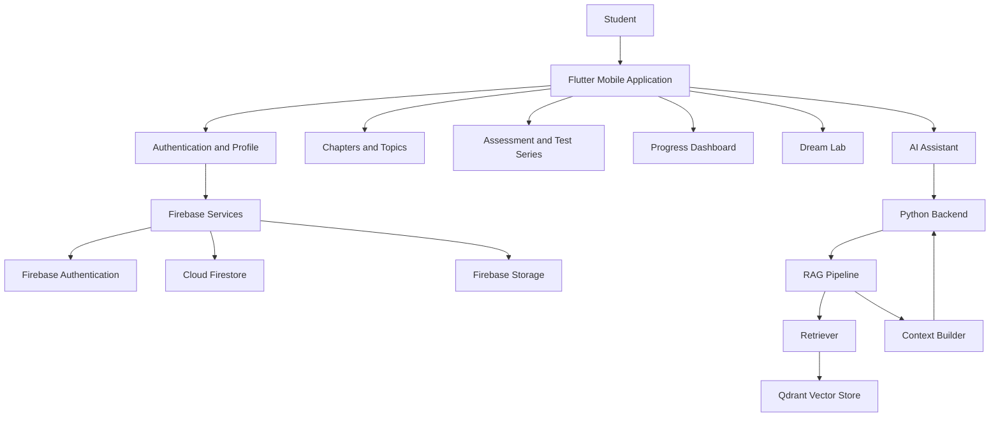
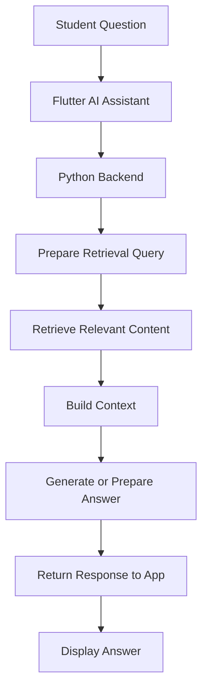
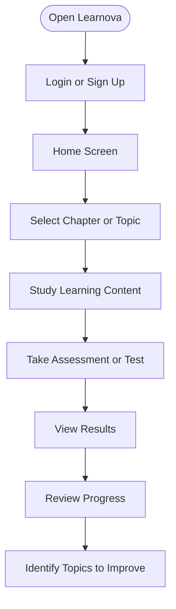

# Learnova — AI-Powered Learning Platform

Learnova is an AI-powered educational application built with Flutter and Python to support interactive learning, assessments, AI-assisted explanations, and student progress tracking.

The platform combines a mobile learning interface with backend services for AI assistance, retrieval-augmented generation (RAG), assessment processing, and educational content retrieval.

## Overview

Learnova aims to make learning more interactive and personalized through structured learning content, assessments, AI-assisted explanations, progress analytics, and virtual science practicals.

## Key Modules

- **AI Assistant:** AI-assisted educational question answering.
- **Chapters and Topics:** Organized learning content.
- **Assessment:** Student assessments and evaluation.
- **Test Series:** Test-taking and result screens.
- **Progress Tracking:** Subject performance, topic performance, trends, and recent tests.
- **Explanation Module:** Dedicated screen for learning explanations.
- **Dream Lab:** Interactive chemistry and physics practical experiences.
- **User Accounts:** Login, signup, email verification, and profile screens.
- **Admin Dashboard:** Administrative interface.

## Technology Stack

| Component | Technology |
|---|---|
| Mobile application | Flutter, Dart |
| Backend API | Python |
| Authentication | Firebase Authentication |
| Database | Cloud Firestore |
| File storage | Firebase Storage |
| AI retrieval pipeline | Retrieval-Augmented Generation (RAG) |
| Vector storage | Qdrant integration |
| Text embeddings | Python embedding module |
| Speech input | Speech-to-Text |
| Voice output | Flutter TTS |
| Video playback | Video Player |
| Markdown rendering | Flutter Markdown |
| UI animations | Flutter Animate |

*Note: The RAG components and Qdrant integration are present in the project structure. The AI models, deployment configuration, and production readiness should be documented after verification.*

## System Architecture



## AI Assistant and RAG Workflow



This diagram illustrates the intended retrieval-augmented answering flow. The actual generation provider and integration should be confirmed from the backend implementation.

## Assessment and Learning Workflow



## Project Structure

```text
learnovaapp/
├── assets/
│   └── Images, logos and animations
├── backend/
│   ├── app.py
│   ├── assessment_engine.py
│   ├── assistant_engine.py
│   ├── explanation_engine.py
│   ├── test_series_engine.py
│   ├── check_models.py
│   ├── requirements.txt
│   └── rag/
│       ├── chunker.py
│       ├── context_builder.py
│       ├── create_collection.py
│       ├── embeddings.py
│       ├── ingest.py
│       ├── qdrant_store.py
│       └── retriever.py
├── lib/
│   ├── screens/
│   │   ├── ai_assistant/
│   │   ├── chapters/
│   │   ├── dream_lab/
│   │   ├── explanation/
│   │   ├── home/
│   │   ├── progress/
│   │   ├── test_series/
│   │   └── topics/
│   ├── services/
│   ├── themes/
│   ├── widgets/
│   ├── admin_dashboard.dart
│   ├── assessment_page.dart
│   ├── login_page.dart
│   ├── signup_page.dart
│   ├── profile_page.dart
│   ├── main.dart
│   └── firebase_options.dart
├── test/
├── android/
├── ios/
├── web/
├── pubspec.yaml
├── LEARNOVA_SYSTEM_DESIGN.md
└── README.md
```

## Getting Started

### Prerequisites

- Flutter SDK compatible with the project's Dart SDK constraint
- Android Studio or Visual Studio Code
- Python installed for the backend
- A configured Firebase project
- A configured Qdrant service if running the RAG pipeline

### 1. Clone the Repository

```bash
git clone https://github.com/Sumit182004/LearnovaApp.git
cd LearnovaApp
```

If your repository URL or capitalization differs, use the exact URL displayed on GitHub.

### 2. Configure Flutter

Run these commands from the Flutter project root:

```bash
flutter pub get
flutter doctor
```

### 3. Configure Firebase

Set up the Firebase project and verify the platform configuration used by the application.

Do not commit private service-account keys, API keys, or `.env` files containing secrets.

### 4. Configure the Python Backend

From the project root:

```bash
cd backend
python -m venv .venv
```

Activate the virtual environment.

**Windows PowerShell:**

```powershell
.venv\Scripts\Activate.ps1
```

Install the backend dependencies:

```bash
pip install -r requirements.txt
```

Configure the required environment variables and any AI-provider or vector-store settings before starting the backend. The startup command depends on the implementation in `backend/app.py`.

### 5. Run the Application

Open a terminal in the Flutter project root and run:

```bash
flutter run
```

Ensure that a device or emulator is available and the required Firebase configuration is valid.

## Screenshots

Place your application screenshots in a `screenshots/` directory in the repository.

For example, if your home screen image is stored at `screenshots/home.png`, reference it like this:

```markdown

```

Recommended screenshots include:

- Home screen
- AI Assistant
- Chapters and topics
- Assessment and test results
- Progress dashboard
- Dream Lab

## Security Notes

- Keep `.env` files and service-account JSON keys out of version control.
- Use environment variables for backend secrets.
- Never expose privileged Firebase credentials in the mobile application.
- Configure Firebase security rules and backend authorization appropriately.

## Future Improvements

- Improve the accuracy and evaluation of AI-generated answers.
- Expand the educational content and retrieval pipeline.
- Enhance progress-based personalized learning recommendations.
- Add automated testing for assessment and backend workflows.
- Improve error handling, loading states, and accessibility.

## Author

**Sumit Bhatia**

[GitHub Profile](https://github.com/Sumit182004)